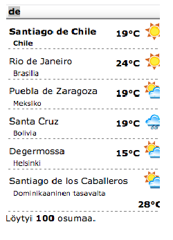

Table of Contents
=================

  * [SmartMet Server](#smartmet-server)
  * [Introduction](#introduction)
  * [Main features](#main-features)
  * [Query string options](#query-string-options)
    * [keyword](#keyword)
    * [pattern](#pattern)
    * [lang (fi)](#lang-fi)
    * [max (15)](#max-15)
    * [page (0)](#page-0)
    * [format (json)](#format-json)
    * [pretty (0)](#pretty-0)
    * [product ()](#product-)
    * [timeformat (iso)](#timeformat-iso)
    * [locale (fi_FI)](#locale-fi_fi)
    * [stamp () y](#stamp--y)
  * [Formatting numeric values](#formatting-numeric-values)
  * [Geolocation](#geolocation)
  * [Docker](#docker)

# SmartMet Server

[SmartMet Server](https://github.com/fmidev/smartmet-server) is a data and product server for MetOcean data. It
provides a high capacity and high availability data and product server
for MetOcean data. The server is written in C++, since 2008 it has
been in operational use by the Finnish Meteorological Institute FMI.

# Introduction

The SmartMet autocmplete plugin provides an efficient and a fast method
for completing the search locations.  It provides the location
information enriched with simple weather information.  The
figure below  shows how the autocomplete plugin suggests several
location information when  we start  to type a search location "de".

The SmartMet autocomplete plugin provides geolocation services for HTML text
fields and IP based location detection. The main idea is to provide a
<a href =
"https://developers.google.com/maps/documentation/javascript/places-autocomplete">Google
Suggest type API</a> geographic information stored in the fminames
database. Autocomplete is a feature of the Places library in the
Google Maps JavaScript API. The autocomplete API can provide a
type-ahead-search behavior of the Google Maps search field. When a
user starts typing an address, autocomplete will fill in the rest.

# Main features

The main 
 features offered by  the plugin are as follows:
1.JSON output
2.Keyword identifies set of allowed locations
3.Language selection
4.Pretty printing for debugging purposes
5.Product specific customization of forecast parameters
6. Pagination of results

# Query string options

Below we describe the query string options. The default value for each option is given in parenthesis. If there is no default value specified, the option is compulsory.

## keyword

The keyword identifies the set of locations enabled in autocomplete. The allowed keywords are listed in

<pre><code> fminames.keywords </code></pre>

and the locations for each keyword in

<pre><code> fminames.keywords_has_geonames </code></pre>

Since Aug 4th 2021 the keyword may be a comma separated list. This enables one to join search results say from city names, amusement parks, golf courses etc.

## pattern  

The pattern is the beginning of the location name usually
typed by the user. SmartMet server converts the UTF8 input to
iso-latin-8859-1 and to lower case to make comparisons
easier. The  collation sevices are in use.

## lang (fi) 

The selected language using a 2-character language ISO-code. If no specific translation exists for a location, the primary name for the location will be returned.

## max (15)  

The number of results to return in one page.

## page (0)  

The page number. This option works in conjuction with the maxresults option.

## format (json)  

This option is deprecated. PHP-serialization used to be supported, but the support was terminated when json_spirit was taken into use.

## pretty (0) 

Pretty print is used mostly for debugging purposes (and regression tests to spot changes more easily).

## product () 

Identify a product name to add localized forecast data to the output. The allowed product names are listed in a table.

<pre><code> autocomplete.products </code></pre>

and the forecast parameters for each product in

and the forecast parameters for each product in

<pre><code> autocomplete.parameters </code></pre>

The default is not to include a forecast in the output.

## timeformat (iso)  

The output format as supported by MacGyver::TimeFormatter (iso, xml, timestamp, sql).

## locale (fi_FI)  

Localization may be used for formatting locale specific forecast parameters.
## stamp () y

Alternate forecast start time used only for creating static regression tests.

# Formatting numeric values

The same options as used in the pointforecast-plugin are available for formatting floating point values:

* missingtext
* width
* fill
* adjustfield
*  showpos
*  uppercase
*  floatfield

# Geolocation

If the option 

<pre><code>locate  </code></pre>

is set, the plugin will attempt to locate the user at the city level, which is the level of accuracy available with the GeoIP database for free.

If the IP is given using the option 
<pre><code> ip </code></pre>

, that  IP will be located. Otherwise the request will be parsed for the header

<pre><code> X-Forwarded-For </code></pre>

 , and if that is not available, actual request IP will be used. 

If GET-parameters contains product-parameter (i.e. &product=rich), corresponding weather forecast information is added to the response.

# Docker

SmartMet Server can be dockerized. This [tutorial](docs/docker.md)
explains how to explains how to configure the Autocomplete plugin of
the SmartMet Server when using Docker.
